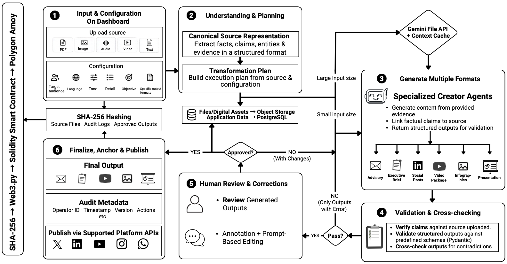

# Gen AI Platform for Automated Content Transformation
### Smart India Hackathon (SIH) 2026 · Problem Statement 26154 (NTRO)

> **A multi-agent content transformation platform that converts source project documents into verified, grounded communication deliverables across 9 formats with automated cross-checking, editorial review controls, selective fact updates, and tamper-evident auditability.**

---

## Key Highlights

- **9 Universal Deliverables**: Executive Summary, Advisory, Presentation, Infographic, Video Package, Twitter / X Post, WhatsApp, LinkedIn Post, and Instagram Post.
- **Multimodal Document Ingestion**: Ingests and validates documents, spreadsheets, logs, audio transcripts, and diagrammatic assets with testnet blockchain hash anchoring.
- **Canonical Grounding**: Atomic fact and claim extraction establishing bidirectional traceability back to source files (`[CLM-001]`, `[CLM-002]`, etc.).
- **Selective Fact Propagation**: When a source claim is modified, dependency graphs identify and update only affected deliverables, keeping unaffected approved work untouched.
- **In-Domain Context Assistant**: Intelligent query assistant grounded in project source facts, designed to stay strictly focused within the current project boundary.
- **Editorial Review Controls**: Full human-in-the-loop oversight. Reviewers can edit text, request prompt adjustments, jump interactively between claims and evidence, and sign off deliverables.
- **Multi-Format Export Pipeline**: One-click download of all campaign assets as ZIP packages containing publication-ready Markdown, formatted DOCX, standalone HTML/PDF slides, social cards, and verification audit manifests.
- **Tamper-Evident Audit Verification**: Cryptographic hashing and verification manifest for publication-ready outputs.

---

## System Workflow Architecture



### End-to-End Pipeline Stages

```
Source Documents (PDFs, Reports, Logs, Notes, Audio)
        ↓
[ 1. Document Ingestion & Cryptographic Anchoring ]
        ↓
[ 2. Canonical Fact & Claim Extraction ]  ───→  Ground-Truth Claim Store
        ↓
[ 3. Transformation Planner (Target Audience, Tone, Deliverable Selection) ]
        ↓
┌────────────────────────────────────────────────────────┐
│  4. Specialized Multi-Agent Generators                 │
│  • Executive Summary       • Security Advisory         │
│  • 16:9 Presentation Deck  • Multimodal Infographic    │
│  • Video Storyboard & Script• Twitter / X Post         │
│  • WhatsApp Broadcast      • LinkedIn Article          │
│  • Instagram Visual Post                               │
└────────────────────────────────────────────────────────┘
        ↓
[ 5. Automated Cross-Consistency & Fact Verification ]
        ↓
[ 6. 3-Column Editorial Review Workspace ]
     ├── Left Rail: Context-Grounded Claims & Source Provenance
     ├── Center: Dedicated Format Editors with Interactive Badges
     └── Right Rail: Cross-Checking Verification Trail & Parameter Tuning
        ↓
[ 7. Fix-Once Fact Propagation (Updates Only Affected Deliverables) ]
        ↓
[ 8. Multi-Channel Export & Publication Manifest (ZIP, PDF, DOCX, JSON) ]
```

---

## Repository Structure

```
├── backend/
│   ├── app/
│   │   ├── agents/                  # 9 specialized deliverable generator modules
│   │   ├── fixtures/                # Canonical ground-truth seed fixtures
│   │   ├── models/                  # Pydantic schemas (canonical, impact, operator, assistant)
│   │   ├── services/                # Gemini client, in-memory store, gatekeeper, canonical extractor, verification
│   │   ├── workflow/                # Transformation planner, cross-checker, impact evaluator, regenerator
│   │   ├── config.py                # Environment and model configurations
│   │   └── main.py                  # FastAPI REST endpoints & orchestration
│   ├── tests/
│   │   ├── test_api.py              # Core API endpoint test suite
│   │   ├── test_assistant.py        # Domain boundary and security guardrail tests
│   │   ├── test_editorial_workflow.py # Reviewer workflow, diff tracking, and sign-off tests
│   │   └── test_selective_update.py # Selective fact propagation preservation tests
│   └── requirements.txt
├── frontend/
│   ├── public/
│   │   └── images/                  # Public infographic visual assets
│   ├── src/
│   │   ├── assets/                  # Brand logos and graphic files
│   │   ├── components/              # Core application screens
│   │   │   ├── HomeScreen.jsx       # Project dashboard and work overview
│   │   │   ├── ConfigureScreen.jsx  # Transformation setup, target audience/tone settings
│   │   │   ├── ProcessingScreen.jsx # Real-time transformation pipeline status
│   │   │   ├── WorkspaceScreen.jsx  # 3-column verification workspace & multi-channel editor
│   │   │   ├── FinalizeScreen.jsx   # Export manifest & verification summary
│   │   │   ├── Sidebar.jsx          # Left navigation rail
│   │   │   ├── common/
│   │   │   │   └── ClaimCitationBadge.jsx # Interactive citation badges & bidirectional claim jumping
│   │   │   └── deliverables/
│   │   │       ├── DocumentEditor.jsx       # Executive Summary & Advisory editor
│   │   │       ├── PresentationEditor.jsx   # 16:9 Slide deck interactive canvas
│   │   │       ├── VideoStoryboardEditor.jsx# Storyboard scenes, audio narration & visual cues
│   │   │       ├── InfographicEditor.jsx    # Multimodal infographic gallery (16:9, 1:1, 9:16, 3:4)
│   │   │       └── SocialMediaEditor.jsx    # Multi-platform previews (Twitter/X, LinkedIn, Instagram, WhatsApp)
│   │   ├── services/
│   │   │   └── api.js               # API client with error boundaries & mock fallback data
│   │   ├── utils/
│   │   │   └── exportUtils.js       # ZIP, PDF, DOCX, Markdown, and JSON manifest export generators
│   │   ├── App.jsx                  # Root routing, error boundaries, and state orchestration
│   │   ├── index.css                # Restrained typography, layout tokens & design system
│   │   └── main.jsx                 # React root mount
│   ├── package.json
│   ├── vercel.json                  # Vercel SPA client rewrite configuration
│   └── vite.config.js
├── docs/
│   ├── SYSTEM_ARCHITECTURE.md       # Detailed architecture, threat model, and verification specifications
│   └── images/
│       └── work-flow.png            # Workflow architecture diagram
├── dummy_data/                      # Sample incident reports, telemetry logs, and threat intelligence
│   ├── 01_incident_report.txt
│   ├── 02_incident_timeline.txt
│   ├── 03_threat_intel.txt
│   ├── 04_affected_system.txt
│   ├── 05_incident_context.txt
│   ├── 06_reference_advisory.txt
│   └── images/
│       ├── work-flow.png            # Architecture workflow diagram
│       ├── infographic16:9.jpg
│       ├── infogrpahic-1:1.jpg
│       ├── infogrpahic-3:4.png
│       └── infogrpahic9:16.jpg
├── .env.example                     # Environment variables template
├── .gitignore
├── requirements.txt
├── vercel.json                      # Root deployment configuration
└── README.md
```

---

## Quickstart Guide

### 1. Backend Setup

```bash
# Navigate to repository root
cd Gen-Ai-26154-SIH

# Create and activate Python virtual environment
python3 -m venv .venv
source .venv/bin/activate

# Install dependencies
pip install -r requirements.txt

# Configure environment variables
cp .env.example .env
# Edit .env to set your GEMINI_API_KEY (optional; system includes full deterministic fallbacks)

# Launch FastAPI backend daemon
PYTHONPATH=backend uvicorn app.main:app --host 0.0.0.0 --port 8000 --reload
```

Backend will be active at `http://localhost:8000`. Swagger documentation available at `http://localhost:8000/docs`.

---

### 2. Frontend Setup

```bash
# Navigate to frontend directory
cd frontend

# Install Node dependencies
npm install

# Start Vite development server
npm run dev
```

Frontend will be active at `http://localhost:3000`.

---

### 3. Running Verification Test Suites

```bash
# Run all automated backend tests from repository root
PYTHONPATH=backend python backend/tests/test_api.py
PYTHONPATH=backend python backend/tests/test_assistant.py
PYTHONPATH=backend python backend/tests/test_editorial_workflow.py
PYTHONPATH=backend python backend/tests/test_selective_update.py
```

All test suites verify:
- Core API endpoints (`/work`, `/transform`, `/edit`, `/approve`, `/claims/{id}`, `/assistant/query`).
- Context Assistant boundary enforcement for project queries.
- Human review workflow (editing, diff tracking, sign-off).
- Selective fact propagation: when a claim changes, unaffected approved deliverables remain intact while affected deliverables regenerate for review.

---

### 4. Vercel Deployment (Frontend)

The repository includes pre-configured `vercel.json` (root) and `frontend/vercel.json` for SPA routing rewrites and automatic Vite builds.
- **Import into Vercel**: Connect this repository to your Vercel account.
- **Root Directory**: `frontend` (or repository root).
- **Framework Preset**: `Vite`.
- **Environment Variables (Optional)**: Set `VITE_API_URL` to your deployed backend URL. If omitted, the frontend operates seamlessly with interactive fallback datasets.

---

## Technical Specifications

- **Backend**: Python 3.11+, FastAPI, Pydantic v2, Google GenAI SDK (`google-genai`).
- **Frontend**: React 18, Vite, Lucide Icons, TipTap, JSZip, FileSaver.
- **Evaluation Criteria**: Grounding accuracy, cross-deliverable consistency, human editorial sovereignty, and selective regeneration efficiency.

---

## License & Attribution

Developed for **Smart India Hackathon 2026** under Problem Statement **26154** (National Technical Research Organisation - NTRO).
